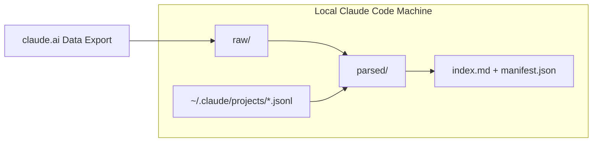

# sync-claude-export

A [Claude Code](https://claude.com/claude-code) skill that gives Claude Code visibility
into history it otherwise can't see at all: your **claude.ai** conversations, Projects,
and memories, plus your **local Claude Code session history** across every project on
this machine. Both are parsed into one unified, searchable local markdown archive.

## Table of Contents

- [Why this exists](#why-this-exists)
- [What it does](#what-it-does)
- [Prerequisites & Requirements](#prerequisites--requirements)
- [Quick start](#quick-start)
- [Keeping your archive up to date](#keeping-your-archive-up-to-date)
- [FAQ / Troubleshooting](#faq--troubleshooting)
- [Known limitations & roadmap](#known-limitations--roadmap)
- [Privacy](#privacy)
- [License](#license)

## Why this exists

If you use claude.ai mostly through the mobile app, Claude Code has zero visibility into
any of it: no conversations, no Projects, no memories, and no way to get them, since the
mobile app has no export or API access at all. Claude Code's own history isn't much better
off either. Session transcripts are scattered across every project directory on your
machine with no unified, searchable view.

This project closes both gaps at once. It builds a **one-way sync only**: a local archive
*from* claude.ai's official data export and *from* local Claude Code `.jsonl` session
transcripts. Nothing pushes data back into claude.ai or the mobile app. There's no
supported API for that direction, and this project doesn't attempt to work around that.

## What it does

- **claude.ai → archive:** walks the account's official data export (conversations,
  per-project knowledge docs, claude.ai's own cross-conversation memory, and Design canvas
  chats) and writes each into readable markdown with YAML frontmatter, cross-referencing
  what can genuinely be linked (e.g. a project's memory sits next to that project's docs)
  and clearly labeling what's only a heuristic guess (e.g. a conversation that mentions a
  project by name, since the export itself carries no conversation→project link).
- **Local Claude Code sessions → archive:** walks every `~/.claude/projects/*/*.jsonl` on
  this machine and extracts human-readable user/assistant text only (never raw tool output
  or file contents) into the same archive.
- Both feed the same `manifest.json` + `index.md`, so re-running after a later export
  updates entries in place instead of duplicating them.

## Prerequisites & Requirements

| Requirement | Why |
|---|---|
| Claude Code logged in via a claude.ai subscription (Pro/Max/Team/Enterprise), **not** a bare `ANTHROPIC_API_KEY` | The Gmail and `claude-in-chrome` connectors this skill uses only load under claude.ai's own OAuth (`/login`). They don't appear at all under pure API-key auth. If you have an API key set, unset it, run `/login`, then check `/mcp` lists both connectors. |
| Python 3 on your `PATH` as `python` or `python3` | Runs `scripts/parse_export.py`, which is stdlib-only (`argparse`, `json`, `urllib`, `zipfile`, `pathlib`). No pip installs needed. |
| **Gmail MCP connector** | Locates the "your data is ready for download" email. |
| **claude-in-chrome MCP connector**, or PowerShell (`Start-Process`) / `open` (macOS) / `xdg-open` (Linux) | Opens the export's one-time download links in a real logged-in browser session. macOS/Linux paths are implemented but not yet verified against a real export on those platforms. See [open issues](https://github.com/airudah2000/sync-claude-export/issues) if you hit something. |

## Quick start

1. Install the skill so it's available in every project, not just one repo. Copy this
   whole folder to `~/.claude/skills/sync-claude-export/` (user-level skills apply across
   all your Claude Code sessions; a user-level skill also takes precedence over a
   project-level one of the same name). Copying it into a single project's
   `.claude/skills/` instead works too, but then it's only usable from that one project.
2. Copy `config.example.json` to `config.json` (same folder) and fill in real `raw_dir` /
   `parsed_dir` paths for where you want the archive to live: a folder *outside* any git
   repo. Forward slashes work fine even on Windows and avoid JSON backslash-escaping
   mistakes (e.g. `"C:/Users/you/ClaudeAI-Sync/raw"`).
3. Trigger a claude.ai data export (Settings → Privacy → Export Data; web/desktop only,
   not available from the mobile app) and then just ask Claude Code to run the
   `sync-claude-export` skill. It handles finding the export-ready email, downloading each
   category, and parsing everything into the archive. **Run the skill the same day**:
   the emailed download link expires 24 hours after delivery.

See `SKILL.md` for the authoritative, exact step-by-step Claude Code follows. This README
stays intentionally high-level so it doesn't go stale as those steps evolve.

## Keeping your archive up to date

There's no automated reminder to re-export, since claude.ai's export trigger has no API and
can't be scheduled from inside this skill. A Claude Code scheduled job can't durably cover
a monthly cadence either, because jobs are session-only and recurring ones auto-expire
after 7 days. The practical answer is manual: **set your own recurring reminder** to
re-trigger the export and re-run this skill. It's safe to run repeatedly. Re-parsing
updates existing entries in place instead of duplicating them.

## FAQ / Troubleshooting

**Gmail search finds zero matching threads.**
Check, in order: the export hasn't actually been triggered yet (or the email hasn't arrived
yet; it can take a few hours), the email landed in Spam/Promotions, or Gmail MCP is
connected to a different account than the one you exported from.

**The Gmail or `claude-in-chrome` connector doesn't show up in `/mcp` at all.**
Both require claude.ai subscription login (`/login`), not API-key auth. See
[Prerequisites](#prerequisites--requirements). Unset `ANTHROPIC_API_KEY` and re-authenticate.

**Opening the download link just shows an HTML/login page (`FALLBACK_NEEDED`).**
This isn't a bug. It's expected on some accounts (e.g. certain SSO setups). Ask Claude to
fall back to the manual path: download the file yourself from the email link and hand
Claude the path.

**The download link says it's expired, or nothing downloads.**
Links expire 24 hours after the "ready for download" email, and each of the 5 per-category
links is single-use. Re-trigger a fresh export and start over.

**`config.json` fails to parse.**
Almost always a Windows path typed with single backslashes into JSON. Use forward slashes
instead, e.g. `"C:/Users/you/ClaudeAI-Sync/raw"`. `pathlib` accepts these fine on any OS.

**A conversation got tagged with a wrong `related_projects` entry.**
That field is an explicit heuristic guess, not a confirmed link. Occasional incidental
matches are expected, and the field is never used to move or merge files, only to annotate.

**Two projects/design-chats share a name. Did one overwrite the other?**
No. Folders are suffixed with each project's own short ID specifically to prevent this,
verified against real exports with zero collisions.

**Where should I put this skill folder?**
`~/.claude/skills/sync-claude-export/` (user-level) for use from any project. That's almost
always what you want for an account-wide sync tool. A project's own `.claude/skills/` only
makes sense if you deliberately want it scoped to that one project.

## Known limitations & roadmap

Tracked as [GitHub Issues](https://github.com/airudah2000/sync-claude-export/issues).
Currently just verifying macOS/Linux support on real hardware, since development so far
has been Windows-only.

## Privacy

The generated archive contains your real personal conversation history. `config.json`
(which points at that archive's real location) is already gitignored. Never commit it.
If the archive folder itself ever ends up inside a git repo for any reason, gitignore it
too; it isn't meant to be checked in anywhere.

## License

[MIT](LICENSE)
